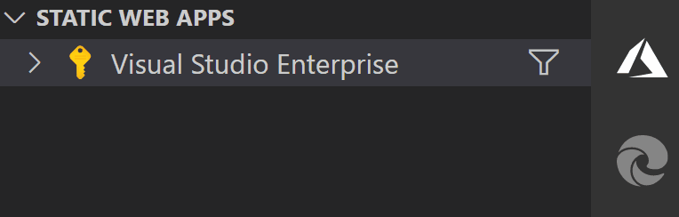
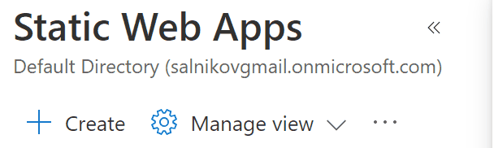

# BPM Techno - Free Online Real-Time BPM Counter for DJ

<p align="center">
    
</p>

This is a 3-in-1 project:

1. A real product for DJs to help with identifying BPM (beats per minute) of the track currently playing.
2. A real-world demo and a playground for [Azure Static Web Apps](https://azure.microsoft.com/en-us/services/app-service/static/?ocid=aid3040965_ThankYou_DevComm&eventId=SWA_43q5ZzJFbkY0) service.
3. Proof of concept for a Progressive Web App (PWA) driven by Workbox-powered service worker.

### Web application (installable, offline-ready)

[BPMTech.no](https://bpmtech.no) - Free Online Real-Time BPM Counter for DJ

### Video demo

[](https://youtu.be/o9BIK5QENJU)

*(click to watch on YouTube)*

## This is a 3-in-1 project:

1. A real product for DJs to help with identifying BPM (beats per minute) of the track currently playing.
2. A real-world demo and a playground for [Azure Static Web Apps](https://azure.microsoft.com/en-us/services/app-service/static/?ocid=aid3040965_ThankYou_DevComm&eventId=SWA_43q5ZzJFbkY0) (SWA) service.
3. Proof of concept for a Progressive Web App (PWA) driven by Workbox-powered service worker.

## Flow and resources for the Azure Static Web Apps features demo

### Installation

```shell
git clone https://github.com/webmaxru/bpm-counter.git
cd bpm-counter
npm install

# Installing tools for Static Web Apps and Azure Functions
npm install -g @azure/static-web-apps-cli
npm install -g azure-functions-core-tools@3 --unsafe-perm true
```

### Starting local development server

```shell
# Instead of CRA's "npm start" we use SWA CLI's command to start everything at once
swa start http://localhost:3000 --run "npm start" --api ./api
```

Open [http://localhost:4280](http://localhost:4280) in your browser.

### Deploying to Azure

To deploy this project to Azure, you need to fork this repo to your own GitHub account. You will also need an Azure subscription. If you don't have it, you can [get Azure subscription here for free](https://aka.ms/free-azure-pass) with $200 credit.

*Please note, that Azure Static Web Apps service has a [generous free tier](https://azure.microsoft.com/en-us/pricing/details/app-service/static/?ocid=aid3040965_ThankYou_DevComm&eventId=SWA_43q5ZzJFbkY0) which is enough for many types of the personal projects.*

After you have the repo in your GitHub account, and Azure subscription ready, use an [Azure Static Web Apps extension for Visual Studio Code](https://marketplace.visualstudio.com/items?itemName=ms-azuretools.vscode-azurestaticwebapps) or [Azure Portal](https://portal.azure.com/?feature.customportal=false#create/Microsoft.StaticApp) to create an SWA resource.

<p align="center">
    
    - or -
    
</p>

Use the following parameters:

- App location: **/**
- Api location: **api**
- Output location: **build**

What will happen:

- In a few seconds, you will see the website deployed to Azure with a development URL like *random-word.azurestaticapps.net*. You can connect your own custom domain to it using "Custom domain" option in the portal.
- A GitHub Actions file will be created in `.github/workflows` folder of your repo. Similar to [the one](https://github.com/webmaxru/bpm-counter/blob/main/.github/workflows/azure-static-web-apps-mango-mud-0136f961e.yml) in the original repo.

You are now ready to explore the Azure Static Web Apps features.

### Automatic deployment on code change

1. Do any code change in the application. Something that will be clearly visible on the first page, for example [app name](https://github.com/webmaxru/bpm-counter/blob/main/src/App.js#L70) in the header.
2. Commit and push the changes to `main` branch (or the branch you specified during resource creation).
3. Go to [Actions](https://github.com/webmaxru/bpm-counter/actions) page of your repo to make sure that the workflow is running.
4. On completion, open your website in a browser, you will see the new version.

**Please note, this is a service worker-driven application, so you will see the prompt to reload the page.**

### Automatic deployment on code change

1. Create a branch for your new feature.

```shell
git checkout -b new-feature
```

Do any code change in the application. Something that will be clearly visible on the first page, for example [change background color](https://github.com/webmaxru/bpm-counter/blob/main/src/index.css#L16).

2. Commit and push the changes to the branch.

```shell
git add .
git commit -m "New feature"
git push origin new-feature
```

3. Go to you GitHub repo page and create a new [Pull Request](https://github.com/webmaxru/bpm-counter/pull/2) from the branch.

4. Go to [Actions](https://github.com/webmaxru/bpm-counter/actions) page of your repo to make sure that the workflow is running.

5. On completion, you will have a new version of the website deployed to Azure to a new URL. You can get this URL either from the workflow output on Azure or in the Azure Portal on Environments tab.

6. Now, you can run various tests on your new version.

If the new version looks good and you merge this Pull Request to the main (tracked by SWA) branch, the workflow will automatically deploy the new version to this tracked branch and delete staging environment.

**Please note, staged versions of your application are currently accessible publicly by their URL, even if your GitHub repository is private.**

### API Using Azure Functions


## React-only version (no cloud)

In the project directory, you can run:

### `npm run start`

Runs the app in the development mode.\
Open [http://localhost:3000](http://localhost:3000) to view it in the browser.

The page will reload if you make edits.\
You will also see any lint errors in the console.

The service worker is not in use in the development environment.

### `npm run build`

Builds the app for production to the `build` folder.\
It correctly bundles React in production mode and optimizes the build for the best performance.

The build is minified and the filenames include the hashes.\
Your app is ready to be deployed!

The production-ready service worker will also be generated.


## Demo of the Azure Static Web Apps features

You can find the features listed in [About](https://bpmtech.no/about) section.

## About

### Credits

The beat detection is based on [realtime-bpm-analyzer](https://www.npmjs.com/package/realtime-bpm-analyzer) library by [dlepaux](https://github.com/dlepaux)

### Author

&copy; 2021 [Maxim Salnikov](https://twitter.com/webmaxru)